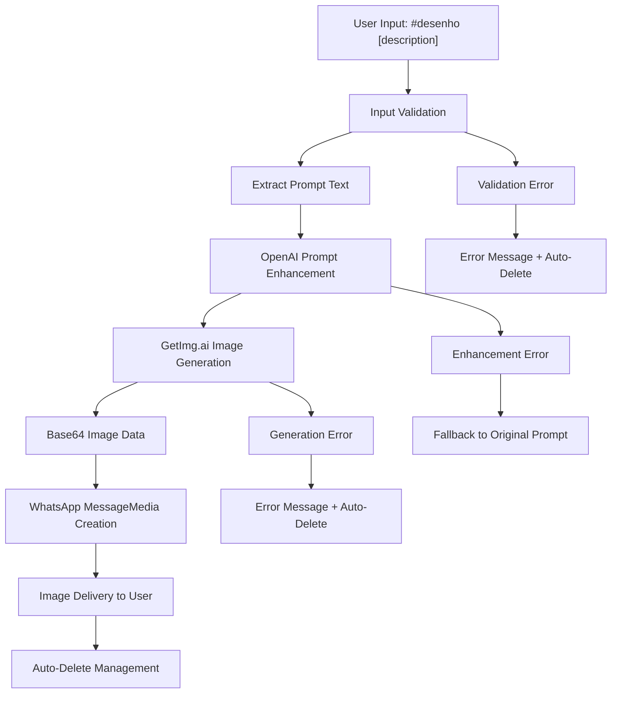
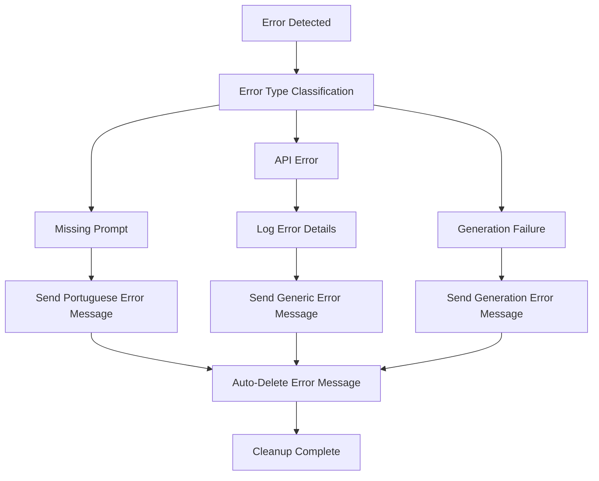
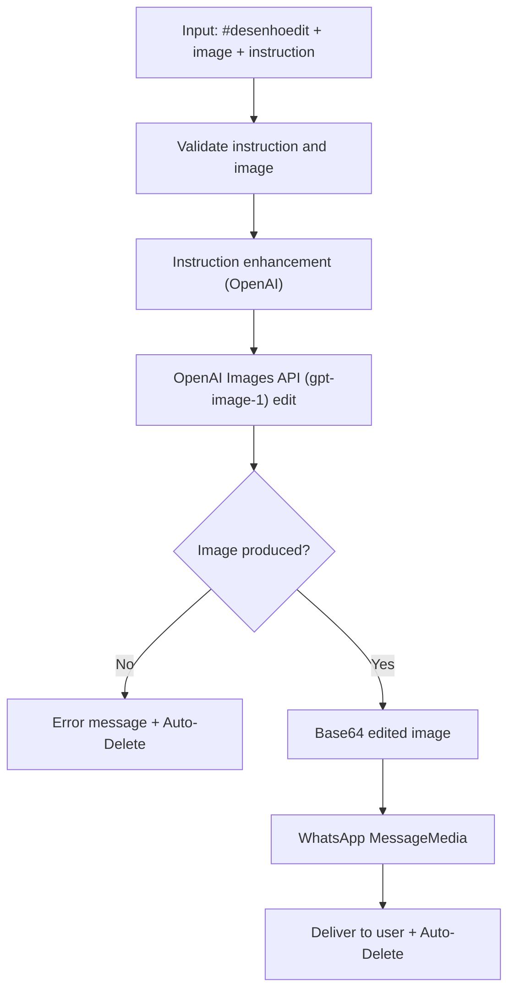

# Desenho Module Documentation

## Overview

AI-powered image generation and editing system with routing logic:
- Public figure requests → GetImg.ai (text-to-image)
- Non-public figure requests → OpenAI Images API (`gpt-5`)
- All edits → OpenAI Images API (images/edits)

The system uses gpt-5-nano to classify whether a request is about a public figure, then routes accordingly. Image generation (`#desenho`) uses prompt enhancement, while editing (`#desenhoedit`) uses raw user input. User-facing replies are in Portuguese; code comments and documentation are in English.

## Core Features

- **AI Image Generation (Routed)**: Public figure→GetImg.ai; others→OpenAI `gpt-5`
- **Selective Enhancement**: Generation uses prompt enhancement; editing uses raw input
- **Portuguese UX**: User-facing texts in Portuguese; code/docs in English
- **Auto-Deletion**: Configurable automatic deletion of error messages and responses
- **Error Handling**: Comprehensive error management with defensive fallbacks
- **Media Integration**: Delivery via WhatsApp Web.js `MessageMedia`
- **Image Editing**: All edits handled by OpenAI Images API (`gpt-image-1`)

## Usage Examples

### Basic Image Generation
```javascript
// User command
#desenho uma paisagem montanhosa ao pôr do sol

// System automatically enhances prompt and generates image
```

### Configuration Setup
```javascript
const DESENHO_CONFIG = {
    prefixes: ['#desenho'],
    autoDelete: {
        errorMessages: true,
        commandMessages: false,
        deleteTimeout: 60000
    },
    model: '', // Uses default OpenAI model
    prompt: DESENHO_PROMPT
};
```

### Programmatic Usage
```javascript
const { generateImage, improvePrompt } = require('./desenhoUtils');

// Enhance user prompt
const improvedPrompt = await improvePrompt("uma casa moderna");

// Generate image
const imageBase64 = await generateImage(improvedPrompt);
```

### Image Editing
```javascript
// User command (with attached image or quoting an image)
#desenhoedit make the image more cinematic and high contrast

// The system enhances the instruction and performs the edit via OpenAI Images API
```

## Architecture Overview

The desenho module implements a **Two-Stage AI Pipeline Pattern**:

1. **Prompt Enhancement Stage**: Uses OpenAI to transform basic user input into detailed, optimized prompts
2. **Image Generation Stage**: Processes enhanced prompts through GetImg.ai's photorealism model

**Processing Flow**:
```
User Input → Prompt Validation → AI Enhancement → Image Generation → Media Delivery → Auto-Cleanup
```

**Design Patterns**:
- **Command Handler Pattern**: Structured command processing with validation
- **Service Layer Pattern**: Separated business logic in utils modules
- **Configuration-Driven**: Centralized settings management
- **Error Boundary Pattern**: Comprehensive error handling with user feedback

## File Structure & Roles

```
desenho/
├── desenho.js              # Main command handler and orchestration
├── desenho.config.js       # Configuration settings and parameters
├── desenho.prompt.js       # AI prompt templates for enhancement
└── desenhoUtils.js         # Core utilities for image generation and prompt processing
```

### File Responsibilities

- **`desenho.js`**: Primary command handler, input validation, workflow orchestration, error management
- **`desenho.config.js`**: Command configuration, error messages, auto-deletion settings, model selection
- **`desenho.prompt.js`**: AI prompt templates for image description enhancement
- **`desenhoUtils.js`**: External API integration (GetImg.ai, OpenAI), image processing utilities

## Core Components

### Command Handler (`desenho.js`)
```javascript
async function handleDesenho(message, command, input = []) {
    // Input validation and array normalization
    const inputArray = Array.isArray(input) ? input : message.body.split(' ');
    const promptInput = inputArray.slice(1).join(' ');
    
    // Two-stage AI processing
    const improvedPrompt = await improvePrompt(promptInput);
    const imageBase64 = await generateImage(improvedPrompt);
    
    // Media delivery with error handling
    const media = new MessageMedia('image/png', imageBase64, 'generated_image.png');
    const response = await message.reply(media);
}
```

### Image Generation Service (`desenhoUtils.js`)
```javascript
async function generateImage(prompt, cfg_scale = 7) {
    const response = await axios.post('https://api.getimg.ai/v1/essential-v2/text-to-image', {
        prompt: prompt,
        style: 'photorealism',
        aspect_ratio: '1:1',
        output_format: 'png',
        cfg_scale: cfg_scale
    }, {
        headers: {
            Authorization: `Bearer ${config.CREDENTIALS.GETIMG_AI_API_KEY}`
        }
    });
}
```

### Image Editing Service (`desenhoUtils.js`)
```javascript
async function editImageWithOpenAI(imageBase64, prompt, options) {
  // Uses OpenAI Images API (gpt-image-1) to edit an image
}
```

### Prompt Enhancement Service
```javascript
async function improvePrompt(prompt) {
    const promptTemplate = DESENHO.IMPROVE_PROMPT.replace('{prompt}', prompt);
    return await runCompletion(promptTemplate, 0.7);
}
```

## Data Flows

### Standard Image Generation Flow


### Error Handling Flow


### Image Editing Flow


## Configuration Schema

### Main Configuration (`desenho.config.js`)
```javascript
{
    prefixes: ["#desenho"],                    // Command triggers
    description: "string",                     // Command description
    autoDelete: {
        errorMessages: boolean,                // Auto-delete error messages
        commandMessages: boolean,              // Auto-delete command responses
        deleteTimeout: number                  // Deletion delay in milliseconds
    },
    errorMessages: {
        noPrompt: "string",                   // Missing prompt error (Portuguese)
        generateError: "string",              // Generation failure error
        notAllowed: "string"                  // Permission denied error
    },
    useGroupPersonality: boolean,             // Group context usage
    model: "string",                          // OpenAI model selection
    prompt: "object"                          // Prompt templates
}
```

### Edit Configuration (`desenho.config.js`)
```javascript
{
    prefixes: ["#desenhoedit"],               // Disparo do comando de edição
    description: "string",
    autoDelete: { errorMessages: boolean, commandMessages: boolean, deleteTimeout: number },
    errorMessages: {
        noImage: "string",                    // Missing image
        noInstruction: "string",              // Missing instruction
        editError: "string",                  // Edit failure
        notAllowed: "string"                  // Permission denied
    },
    useGroupPersonality: boolean,
    model: "string",
    prompt: "object"
}
```

### Prompt Configuration (`desenho.prompt.js`)
```javascript
{
    IMPROVE_PROMPT: "string"                  // Template for prompt enhancement
}
```

### API Configuration Requirements
```javascript
// Required environment variables
GETIMG_AI_API_KEY                           // GetImg.ai API access token
OPENAI_API_KEY                              // OpenAI API access (via configs)
```

## External Dependencies

### GetImg.ai Integration
- **Service**: Essential V2 Text-to-Image for public figure requests
- **Endpoint**: `https://api.getimg.ai/v1/essential-v2/text-to-image`
- **Authentication**: Bearer token via API key
- **Output**: Base64 PNG (or `image_url` → fetched and converted)

### OpenAI Images Integration
- **Service**: `gpt-image-1` for non-public figure generation and all edits
- **Endpoints**: Images Generate and Images Edits
- **Output**: Base64 PNG

### OpenAI Integration
- **Service**: Completion API for prompt enhancement
- **Model**: Configurable (defaults to system default)
- **Temperature**: 0.7 for creative prompt generation
- **Purpose**: Transform basic descriptions into detailed image prompts

### WhatsApp Web.js Integration
- **MessageMedia**: Image delivery mechanism
- **Format**: PNG with base64 encoding
- **Filename**: `generated_image.png`

## Internal Dependencies

### Core System Dependencies
```javascript
// Message handling and auto-deletion
const { handleAutoDelete } = require('../utils/messageUtils');

// WhatsApp media handling
const { MessageMedia } = require('whatsapp-web.js');

// Logging system
const logger = require('../utils/logger');

// OpenAI completion utilities
const { runCompletion } = require('../utils/openaiUtils');

// System configuration access
const config = require('../configs');
```

### Cross-Module Relationships
- **Configuration System**: API key management and model selection
- **Logging System**: Debug and error tracking across generation pipeline
- **Message Utilities**: Auto-deletion and response management
- **OpenAI Utilities**: Shared completion infrastructure for prompt enhancement
- **Command System**: Integration with core command handler and registry

### Data Sharing Patterns
- **Credential Management**: Centralized API key access via configs module
- **Error Handling**: Standardized error messages and auto-deletion patterns
- **Logging Integration**: Consistent debug/error reporting across AI pipeline stages
- **Model Configuration**: Shared OpenAI model selection and parameter management 