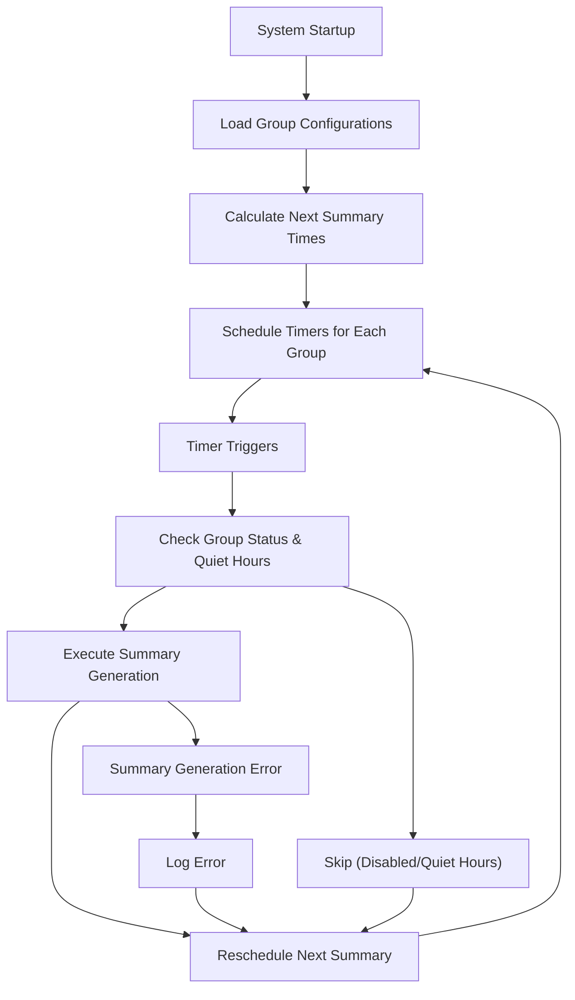
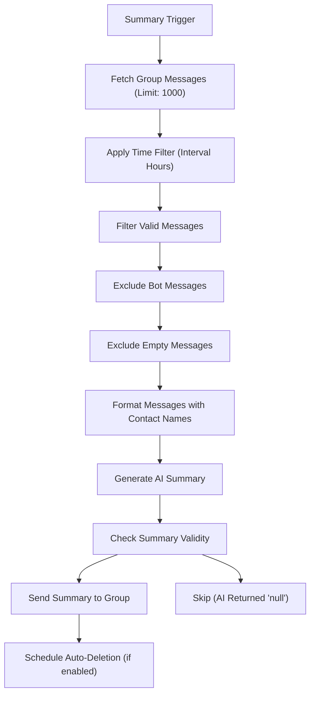
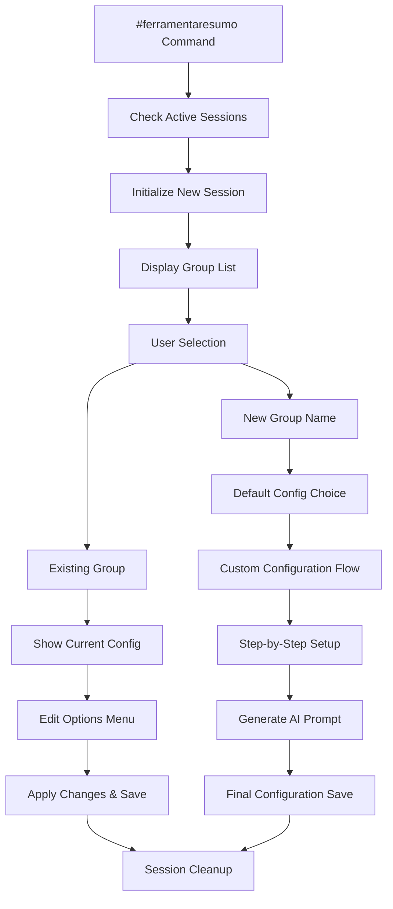

# Periodic Summary Module Documentation

## Overview

Automated WhatsApp group message summarization system that generates periodic AI-powered summaries of group conversations. Features intelligent scheduling with quiet hours, configurable intervals, automatic message filtering, and a comprehensive wizard-based configuration interface. Supports multi-group management with environment variable mapping and dynamic group addition/removal.

## Core Features

- **Automated Scheduling**: Intelligent periodic summary generation with configurable intervals (1-24 hours)
- **Quiet Hours Management**: Timezone-aware quiet periods to prevent summaries during specified hours
- **AI-Powered Summarization**: OpenAI integration for intelligent message summarization in Portuguese
- **Message Filtering**: Smart filtering of valid messages excluding bot messages and empty content
- **Configuration Wizard**: Interactive setup interface with step-by-step group configuration
- **Environment Mapping**: Dynamic environment variable management for group identification
- **Multi-Group Support**: Simultaneous management of multiple WhatsApp groups with individual settings
- **Auto-Deletion**: Optional automatic deletion of summary messages after specified time periods

## Usage Examples

### Basic Summary Generation
```javascript
// Manual summary execution
const { runPeriodicSummary } = require('./periodicSummary');
const result = await runPeriodicSummary('Group Name', false, { returnOnly: true });

// Force summary generation (ignores quiet hours and enabled status)
const forceResult = await runPeriodicSummary('Group Name', true);
```

### Configuration Management
```javascript
// Add new group with custom settings
const groupConfig = {
    enabled: true,
    intervalHours: 6,
    quietTime: { start: '22:00', end: '08:00' },
    deleteAfter: 120 // minutes
};
PERIODIC_SUMMARY.addGroup('New Group Name', groupConfig);
```

### Wizard Interface Usage
```javascript
// Start configuration wizard
#ferramentaresumo

// User follows interactive prompts for:
// - Group selection/creation
// - Interval configuration
// - Quiet hours setup
// - Auto-deletion settings
// - Custom prompt generation
```

## Architecture Overview

The periodicSummary module implements a **Multi-Layer Configuration Management Pattern**:

1. **Scheduling Layer**: Intelligent timing with quiet hours and interval management
2. **Processing Layer**: Message fetching, filtering, and AI summarization
3. **Configuration Layer**: Dynamic group management with environment variable mapping
4. **Wizard Layer**: Interactive configuration interface with state management

**Processing Flow**:
```
Schedule Check → Group Validation → Message Fetching → Content Filtering → AI Summarization → Delivery → Auto-Cleanup
```

**Design Patterns**:
- **State Machine Pattern**: Wizard interface with comprehensive state management
- **Configuration-Driven Architecture**: Centralized settings with defaults and overrides
- **Environment Abstraction**: Dynamic mapping between group names and environment variables
- **Timeout Management**: Session-based timeout handling with automatic cleanup

## File Structure & Roles

```
periodicSummary/
├── periodicSummary.js              # Core summarization logic and message processing
├── periodicSummary.config.js       # Configuration management and group settings
├── periodicSummary.prompt.js       # AI prompt templates for summarization
├── periodicSummaryUtils.js         # Scheduling utilities and group management
├── envMapper.js                    # Environment variable mapping and management
└── wizard/
    ├── wizard.js                   # Interactive configuration wizard
    ├── wizard.config.js            # Wizard-specific configuration
    ├── configUtils.js              # Configuration file management utilities
    ├── groupManager.js             # Group lifecycle management
    └── periodicSummaryConfig.prompt.js  # Wizard prompt templates
```

### File Responsibilities

- **`periodicSummary.js`**: Core summarization engine, message processing, AI integration, quiet hours logic
- **`periodicSummary.config.js`**: Group configuration storage, defaults management, dynamic group addition
- **`periodicSummary.prompt.js`**: AI prompt templates for message summarization
- **`periodicSummaryUtils.js`**: Scheduling algorithms, next summary calculation, automatic scheduling
- **`envMapper.js`**: Environment variable management, group-to-key mapping, .env file manipulation
- **`wizard/wizard.js`**: Interactive configuration interface, state machine implementation, user session management
- **`wizard/configUtils.js`**: Configuration file writing, format management, environment variable integration
- **`wizard/groupManager.js`**: Group lifecycle operations, creation/deletion workflows

## Core Components

### Summarization Engine (`periodicSummary.js`)
```javascript
async function runPeriodicSummary(groupName, forceRun = false, options = {}) {
    // Configuration validation and quiet hours check
    const groupConfig = getGroupConfig(rawGroupConfig);
    if (!forceRun && isQuietTime(groupConfig.quietTime)) return false;
    
    // Message fetching and filtering
    const messages = await chat.fetchMessages({ limit: 1000 });
    const validMessages = messages.filter(message => 
        !message.fromMe && 
        message.body.trim() !== '' && 
        new Date(message.timestamp * 1000) > cutoffTime
    );
    
    // AI summarization
    const summaryText = await runCompletion(promptToUse + '\n\n' + messageTexts.join(''), 0.7);
    
    // Delivery and cleanup
    if (summaryText.trim().toLowerCase() !== 'null') {
        await chat.sendMessage(summaryText);
    }
}
```

### Configuration Management (`periodicSummary.config.js`)
```javascript
const PERIODIC_SUMMARY = {
    defaults: {
        intervalHours: 3,
        quietTime: { start: '21:00', end: '09:00' },
        deleteAfter: null,
        promptPath: './periodicSummary.prompt.js'
    },
    groups: {
        [process.env.GROUP_AG]: {
            enabled: false,
            intervalHours: 2,
            quietTime: { start: '01:00', end: '01:30' }
        }
    }
};
```

### Environment Mapping (`envMapper.js`)
```javascript
function addNewGroup(groupName, abbreviation, type = 'GROUP') {
    const newKey = `${type}_${abbreviation}`;
    
    // Update runtime maps
    groupMap[newKey] = baseGroupName;
    reverseGroupMap[baseGroupName] = newKey;
    
    // Update .env file
    const envContent = fs.readFileSync(envPath, 'utf8') + `${newKey}=${baseGroupName}\n`;
    fs.writeFileSync(envPath, envContent);
    
    // Update process.env
    process.env[newKey] = baseGroupName;
}
```

### Wizard State Machine (`wizard/wizard.js`)
```javascript
// State management with timeout handling
function setUserState(userId, chatId, state, data = {}) {
    nlpProcessor.setWizardState(userId, chatId, true);
    userStates.set(getStateKey(userId, chatId), {
        state,
        ...data,
        lastActivity: Date.now(),
        timeoutDuration: config.COMMANDS.RESUMO_CONFIG.wizardTimeout
    });
}

// Interactive configuration flow
switch (userState.state) {
    case 'AWAITING_GROUP_SELECTION':
        // Group selection or creation logic
    case 'AWAITING_EDIT_OPTION':
        // Configuration option selection
    case 'AWAITING_INTERVAL':
        // Interval configuration
    // ... additional states
}
```

## Data Flows

### Automatic Scheduling Flow


### Message Processing Flow


### Wizard Configuration Flow


## Configuration Schema

### Main Configuration (`periodicSummary.config.js`)
```javascript
{
    defaults: {
        intervalHours: number,              // Default interval (1-24 hours)
        quietTime: {
            start: "HH:MM",                 // Quiet period start time
            end: "HH:MM"                    // Quiet period end time
        },
        deleteAfter: number|null,           // Auto-deletion time in minutes
        promptPath: "string"                // Path to prompt template file
    },
    groups: {
        [groupName]: {
            enabled: boolean,               // Enable/disable summaries
            intervalHours: number,          // Group-specific interval
            quietTime: {
                start: "HH:MM",
                end: "HH:MM"
            },
            deleteAfter: number|null,       // Group-specific auto-deletion
            prompt: "string"                // Custom prompt template
        }
    }
}
```

### Environment Variable Schema
```javascript
// Group mappings
GROUP_[ABBREVIATION] = "Group Name"     // WhatsApp group names
PHONE_[ABBREVIATION] = "phone@c.us"     // Individual phone numbers

// Member mappings (auto-generated)
MEMBER_[ABBREVIATION]1 = "member1@c.us"
MEMBER_[ABBREVIATION]2 = "member2@c.us"

// Personality mappings (optional)
GROUP_[ABBREVIATION]_PERSONALITY = "personality_description"
```

### Wizard Configuration (`wizard/wizard.config.js`)
```javascript
{
    prefixes: ["#ferramentaresumo"],       // Command triggers
    description: "string",                 // Command description
    autoDelete: {
        errorMessages: boolean,            // Auto-delete error messages
        commandMessages: boolean,          // Auto-delete command responses
        deleteTimeout: number              // Deletion delay
    },
    errorMessages: {
        error: "string",                   // Generic error message
        notAllowed: "string",              // Permission denied
        timeout: "string"                  // Session timeout message
    },
    wizardTimeout: number                  // Session timeout duration (ms)
}
```

## External Dependencies

### OpenAI Integration
- **Service**: Completion API for message summarization and prompt generation
- **Models**: Configurable model selection (defaults to system default)
- **Temperature**: 0.7 for balanced creativity in summaries
- **Purpose**: Generate concise Portuguese summaries of group conversations

### WhatsApp Web.js Integration
- **Chat Management**: Group chat identification and message fetching
- **Message Filtering**: Access to message metadata (timestamp, author, content)
- **Message Delivery**: Summary message sending with auto-deletion support
- **Contact Resolution**: Contact name resolution for message formatting

### File System Integration
- **Environment Files**: Dynamic .env file manipulation for group mappings
- **Configuration Files**: Automatic configuration file generation and updates
- **Backup Management**: Configuration versioning and recovery

## Internal Dependencies

### Core System Dependencies
```javascript
// Configuration management
const config = require('../configs');

// AI completion services
const { runCompletion } = require('../utils/openaiUtils');

// Logging system
const logger = require('../utils/logger');

// NLP processor integration
const nlpProcessor = require('../core/nlpProcessor');
```

### Cross-Module Relationships
- **Configuration System**: Centralized settings management and credential access
- **Logging System**: Comprehensive debug and error tracking across all components
- **OpenAI Utilities**: Shared completion infrastructure for summarization and prompt generation
- **NLP Processor**: Wizard mode activation for command interception during configuration
- **Command System**: Integration with core command handler and permission management

### Data Sharing Patterns
- **Environment Variable Management**: Centralized group-to-key mapping with automatic .env updates
- **Configuration Distribution**: Hierarchical configuration with defaults and group-specific overrides
- **State Management**: Session-based wizard states with timeout handling and cleanup
- **Scheduling Coordination**: Global timer management with per-group scheduling logic
- **Error Handling**: Standardized error reporting and recovery across all components

### Wizard Integration Points
- **Session Management**: User state tracking with automatic timeout and cleanup
- **Configuration Persistence**: Dynamic configuration file generation with environment variable integration
- **Group Lifecycle**: Automated group creation/deletion with environment variable management
- **AI Integration**: Custom prompt generation based on group context and user preferences 