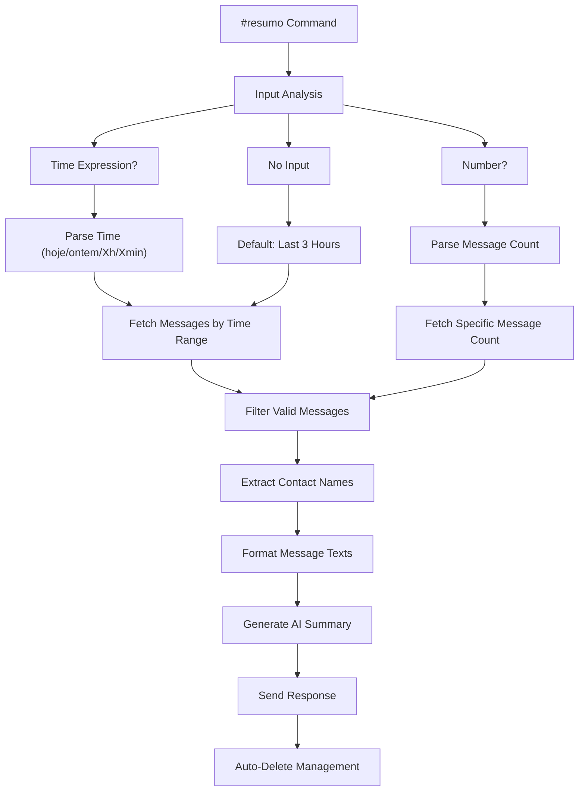
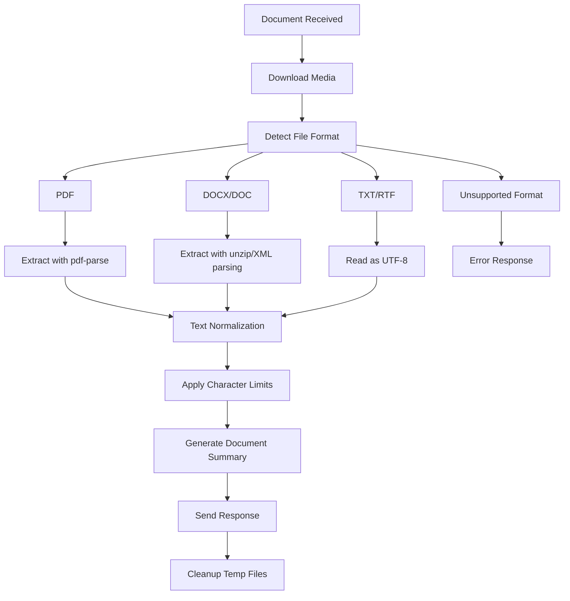
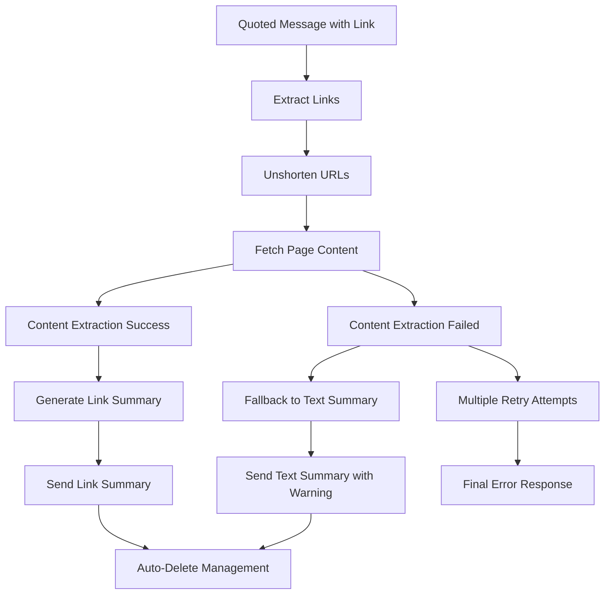

# Resumos Module Documentation

## Overview

Intelligent message and content summarization system for WhatsApp groups that provides AI-powered summaries of conversations, documents, and web links. Features flexible time-based filtering, document processing (PDF, DOCX, DOC, TXT, RTF), web content extraction, quoted message handling, and sticker activation. Supports Portuguese language interface with group personality integration and automatic message cleanup.

## Core Features

- **Multi-Format Summarization**: Messages, documents (PDF/DOCX/DOC/TXT/RTF), web links, and quoted content
- **Flexible Time Filtering**: Natural language time expressions ("hoje", "ontem", "2 horas", "30 minutos")
- **Document Processing**: Advanced text extraction from multiple document formats with character limits
- **Web Content Extraction**: Link processing with unshortening, content fetching, and fallback mechanisms
- **Sticker Activation**: Alternative activation method via specific sticker hash
- **Group Personality Integration**: Context-aware summaries based on group characteristics
- **Auto-Deletion Management**: Configurable automatic cleanup of command messages and errors
- **Batch Message Processing**: Intelligent message fetching with pagination for large conversations
- **Streaming Responses**: Simulated typing effect for better user experience with robot face placeholder

## Usage Examples

### Basic Message Summarization
```javascript
// Time-based summaries
#resumo hoje          // Today's messages
#resumo ontem         // Yesterday's messages
#resumo 2 horas       // Last 2 hours
#resumo 30 minutos    // Last 30 minutes

// Message count summaries
#resumo 50            // Last 50 messages
#resumo 100           // Last 100 messages
```

### Document and Link Processing
```javascript
// Quote a message with document attachment
// System automatically processes PDF/DOCX/DOC/TXT/RTF files

// Quote a message containing links
// System extracts and summarizes web content

// Send document directly with #resumo command
// Processes attached documents immediately
```

### Programmatic Usage
```javascript
const { handleResumos } = require('./resumos');
const { downloadAndProcessDocument } = require('./documentUtils');

// Process document
const text = await downloadAndProcessDocument(message);

// Generate summary with custom prompt
const prompt = getResumoPrompt('DOCUMENT_SUMMARY', { text });
const summary = await runCompletion(prompt, 0.7);
```

## Architecture Overview

The resumos module implements a **Multi-Modal Content Processing Pattern**:

1. **Input Classification**: Determines content type (messages, documents, links, quoted content)
2. **Content Extraction**: Specialized processors for each content type
3. **Text Processing**: Normalization, filtering, and character limit enforcement
4. **AI Summarization**: Context-aware prompt generation and OpenAI integration
5. **Response Management**: Delivery with auto-deletion and error handling

**Processing Flow**:
```
Input Analysis → Content Type Detection → Specialized Processing → Text Extraction → AI Summarization → Streaming Response → Auto-Delete → Cleanup
```

**Design Patterns**:
- **Strategy Pattern**: Different processing strategies for various content types
- **Template Method Pattern**: Standardized prompt generation with variable substitution
- **Chain of Responsibility**: Sequential fallback mechanisms for link processing
- **Factory Pattern**: Dynamic prompt selection based on content type

## File Structure & Roles

```
resumos/
├── resumos.js                  # Main command handler and orchestration logic
├── resumos.config.js           # Configuration settings and parameters
├── resumo.prompt.js            # AI prompt templates for different content types
├── resumoPromptUtils.js        # Prompt processing and variable substitution utilities
└── documentUtils.js            # Document processing and text extraction utilities
```

### File Responsibilities

- **`resumos.js`**: Primary command handler, input parsing, content type routing, message processing workflows
- **`resumos.config.js`**: Command configuration, document settings, link processing parameters, error messages
- **`resumo.prompt.js`**: AI prompt templates for messages, documents, links, and quoted content
- **`resumoPromptUtils.js`**: Prompt template processing, variable substitution, debugging utilities
- **`documentUtils.js`**: Document text extraction, format detection, temporary file management

## Core Components

### Main Command Handler (`resumos.js`)
```javascript
async function handleResumos(message, command, input) {
    // Content type detection and routing
    if (message.hasQuotedMsg) {
        return await handleQuotedMessage(message, command);
    }
    
    if (message.hasMedia && message.type === 'document') {
        const text = await downloadAndProcessDocument(message);
        const prompt = getResumoPrompt('DOCUMENT_SUMMARY', { text });
        const summary = await runCompletion(prompt, 0.7);
        return await sendStreamingResponse(message, summary, command, '🤖');
    }
    
    // Time-based or count-based message processing
    const timeInfo = parseRelativeTime(input);
    if (timeInfo) {
        return await handleTimeBasedSummary(message, timeInfo);
    }
    
    const limit = parseInt(input);
    if (!isNaN(limit)) {
        return await handleSpecificMessageCount(message, limit);
    }
}
```

### Document Processing Engine (`documentUtils.js`)
```javascript
async function extractTextFromDocument(filePath) {
    const ext = path.extname(filePath).toLowerCase();
    
    switch (ext) {
        case '.pdf':
            return await extractTextFromPDF(filePath);
        case '.docx':
        case '.doc':
            return await extractTextFromDOCX(filePath);
        case '.txt':
        case '.rtf':
            return await fs.promises.readFile(filePath, 'utf8');
        default:
            throw new Error('Unsupported file format');
    }
}

async function downloadAndProcessDocument(message) {
    const media = await message.downloadMedia();
    const ext = MIME_TO_EXT[media.mimetype] || path.extname(media.filename);
    
    const filePath = path.join('.', `doc_${Date.now()}${ext}`);
    await fs.promises.writeFile(filePath, media.data, 'base64');
    
    try {
        const text = await extractTextFromDocument(filePath);
        await fs.promises.unlink(filePath); // Cleanup
        return text;
    } catch (error) {
        await fs.promises.unlink(filePath).catch(() => {});
        throw error;
    }
}
```

### Time Parsing System
```javascript
function parseRelativeTime(input) {
    const inputLower = input.toLowerCase().trim();
    
    // Handle Portuguese time expressions
    if (inputLower === 'hoje' || inputLower === 'hj') {
        const today = new Date();
        today.setHours(0, 0, 0, 0);
        return { startTime: today.getTime(), timeDescription: 'as mensagens de hoje' };
    }
    
    // Time unit parsing with regex
    const timeUnits = {
        hora: { multiplier: 3600 * 1000, regex: /(\d+)\s*(?:hora|horas|hr|hrs)/i },
        minuto: { multiplier: 60 * 1000, regex: /(\d+)\s*(?:minuto|minutos|min|mins)/i }
    };
    
    for (const [unit, config] of Object.entries(timeUnits)) {
        const match = inputLower.match(config.regex);
        if (match) {
            const number = parseInt(match[1]);
            return {
                startTime: Date.now() - number * config.multiplier,
                timeDescription: `as mensagens das últimas ${number} ${unit}${number > 1 ? 's' : ''}`
            };
        }
    }
}
```

### Prompt Template System (`resumoPromptUtils.js`)
```javascript
function getResumoPrompt(promptName, variables = {}) {
    const prompt = RESUMO[promptName];
    let processedPrompt = prompt;
    
    // Variable substitution with debugging
    for (const [key, value] of Object.entries(variables)) {
        const regex = new RegExp(`\\{${key}\\}`, 'g');
        processedPrompt = processedPrompt.replace(regex, value?.toString() || '');
    }
    
    return processedPrompt;
}
```

## Data Flows

### Message Summarization Flow


### Document Processing Flow


### Link Processing Flow


## Configuration Schema

### Main Configuration (`resumo.config.js`)
```javascript
{
    prefixes: ["#resumo"],                 // Command triggers
    description: "string",                 // Command description
    stickerHash: "string",                 // Alternative sticker activation
    defaultSummaryHours: number,           // Default time range (hours)
    
    documentSettings: {
        maxCharacters: number,             // Document text limit
        supportedFormats: ["string"],      // Supported file extensions
        tempDir: "string"                  // Temporary file directory
    },
    
    linkSettings: {
        maxCharacters: number,             // Link content limit
        timeout: number,                   // Request timeout (ms)
        retryAttempts: number,             // Retry count on failure
        retryDelay: number                 // Delay between retries (ms)
    },
    
    autoDelete: {
        errorMessages: boolean,            // Auto-delete error messages
        commandMessages: boolean,          // Auto-delete command responses
        deleteTimeout: number              // Deletion delay (ms)
    },
    
    errorMessages: {
        invalidFormat: "string",           // Invalid input format
        noMessages: "string",              // No messages found
        linkError: "string",               // Link processing error
        documentError: "string",           // Document processing error
        documentUnsupported: "string",     // Unsupported document format
        documentTooLarge: "string",        // Document size limit exceeded
        error: "string"                    // Generic error message
    },
    
    useGroupPersonality: boolean,          // Enable group context
    model: "string",                       // OpenAI model selection
    prompt: "object"                       // Prompt templates
}
```

### Document Format Support
```javascript
// MIME type to extension mapping
MIME_TO_EXT = {
    'application/pdf': '.pdf',
    'application/vnd.openxmlformats-officedocument.wordprocessingml.document': '.docx',
    'application/msword': '.doc',
    'text/plain': '.txt',
    'application/rtf': '.rtf'
}

// Supported formats with processing methods
supportedFormats: ['.pdf', '.docx', '.doc', '.txt', '.rtf']
```

### Prompt Templates (`resumo.prompt.js`)
```javascript
{
    DEFAULT: "string",                     // Standard message summarization
    LINK_SUMMARY: "string",                // Web content summarization
    QUOTED_MESSAGE: "string",              // Quoted message summarization
    DOCUMENT_SUMMARY: "string"             // Document content summarization
}
```

## External Dependencies

### OpenAI Integration
- **Service**: Completion API for content summarization
- **Temperature**: 0.7 for documents, 1.0 for messages and links
- **Purpose**: Generate contextual summaries in Portuguese with group personality integration

### Document Processing Libraries
- **pdf-parse**: PDF text extraction with TrueType font handling
- **unzip**: DOCX/DOC document processing via XML extraction
- **fs.promises**: File system operations for temporary file management

### Web Content Processing
- **Link Utilities**: URL unshortening, content fetching, retry mechanisms
- **Content Extraction**: HTML parsing and text normalization
- **Timeout Management**: Configurable request timeouts with fallback handling

### WhatsApp Web.js Integration
- **Media Download**: Document and attachment processing
- **Message Fetching**: Batch message retrieval with pagination
- **Contact Resolution**: Name extraction for message formatting
- **Quoted Messages**: Referenced message processing and reply handling

## Internal Dependencies

### Core System Dependencies
```javascript
// Configuration management
const config = require('../configs');

// AI completion services
const { runCompletion } = require('../utils/openaiUtils');

// Link processing utilities
const { extractLinks, unshortenLink, getPageContent } = require('../utils/linkUtils');

// Message handling utilities
const { handleAutoDelete, resolveContactName } = require('../utils/messageUtils');

// Logging system
const logger = require('../utils/logger');
```

### Cross-Module Relationships
- **Configuration System**: Centralized settings management and model selection
- **OpenAI Utilities**: Shared completion infrastructure with temperature control
- **Link Utilities**: Web content extraction and URL processing services
- **Message Utilities**: Auto-deletion management and contact name resolution
- **Logging System**: Comprehensive debug and error tracking across all processing stages

### Data Sharing Patterns
- **Prompt Template System**: Centralized template management with variable substitution
- **Error Handling**: Standardized error messages with auto-deletion patterns
- **Content Processing**: Shared text normalization and character limit enforcement
- **Group Personality**: Integration with group-specific context and behavior patterns
- **Temporary File Management**: Secure document processing with automatic cleanup

### Processing Integration Points
- **Command System**: Integration with core command handler and permission management
- **Sticker System**: Alternative activation via sticker hash recognition
- **Auto-Deletion**: Coordinated message cleanup with configurable timeouts
- **Batch Processing**: Intelligent message fetching with memory management for large conversations 