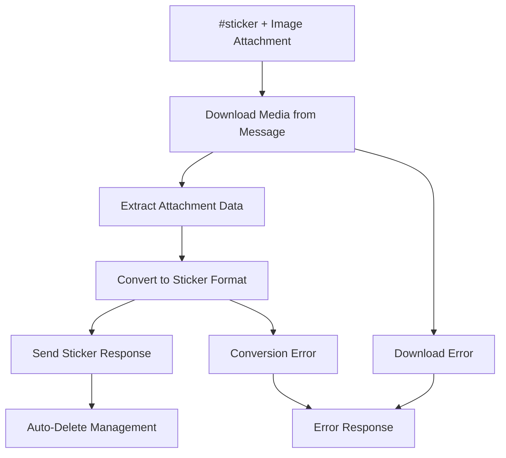
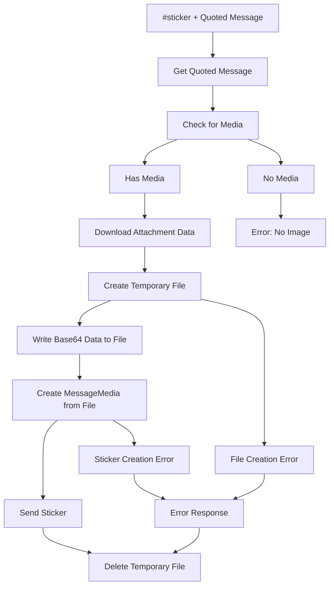
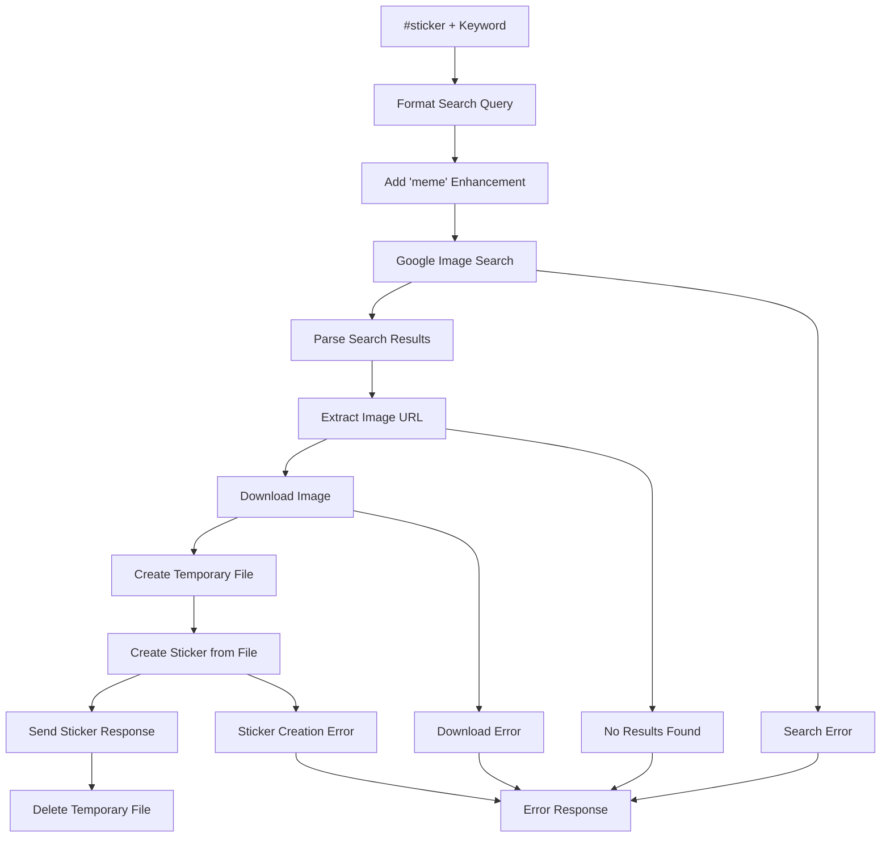

# Sticker Module Documentation

## Overview

Automated sticker creation system for WhatsApp that converts images to stickers through multiple input methods. Features direct image conversion, quoted message processing, and intelligent Google image search with meme enhancement. Supports automatic file cleanup, error handling, and Portuguese language interface with configurable auto-deletion management.

## Core Features

- **Multi-Input Sticker Creation**: Direct image upload, quoted message conversion, and keyword-based search
- **Google Image Search**: Intelligent image discovery with automatic meme keyword enhancement
- **Automatic File Management**: Temporary file creation with guaranteed cleanup and error handling
- **Media Format Support**: Handles various image formats through WhatsApp Web.js MessageMedia
- **Error Recovery**: Comprehensive error handling with user-friendly Portuguese messages
- **Auto-Deletion Management**: Configurable automatic cleanup of command messages and errors
- **Base64 and URL Processing**: Supports both data URLs and external image URLs

## Usage Examples

### Direct Image Conversion
```javascript
// Send image with #sticker command
// System automatically converts attached image to sticker

// Quote a message containing an image
#sticker
// System converts quoted image to sticker
```

### Keyword-Based Search
```javascript
// Search and create sticker from keyword
#sticker gato          // Searches for "gato meme"
#sticker feliz         // Searches for "feliz meme"
#sticker programador   // Searches for "programador meme"
```

### Programmatic Usage
```javascript
const { handleSticker } = require('./sticker');
const { searchGoogleForImage, downloadImage } = require('./imageUtils');

// Search for image
const imageUrl = await searchGoogleForImage('keyword');

// Download and process
const imagePath = await downloadImage(imageUrl);
const imageAsSticker = MessageMedia.fromFilePath(imagePath);
```

## Architecture Overview

The sticker module implements a **Multi-Source Image Processing Pattern**:

1. **Input Classification**: Determines source type (direct media, quoted message, keyword search)
2. **Image Acquisition**: Specialized handlers for each input source
3. **File Management**: Temporary file creation with automatic cleanup
4. **Sticker Conversion**: WhatsApp Web.js integration for sticker creation
5. **Response Management**: Delivery with auto-deletion and error handling

**Processing Flow**:
```
Input Analysis → Source Detection → Image Acquisition → File Processing → Sticker Creation → Cleanup → Response
```

**Design Patterns**:
- **Strategy Pattern**: Different processing strategies for various input sources
- **Template Method Pattern**: Standardized file handling with guaranteed cleanup
- **Factory Pattern**: Dynamic image source selection based on input type
- **Resource Management Pattern**: Automatic temporary file cleanup with try-finally blocks

## File Structure & Roles

```
sticker/
├── sticker.js              # Main command handler and orchestration logic
├── sticker.config.js       # Configuration settings and error messages
├── imageUtils.js           # Google search and image download utilities
└── fileUtils.js            # File management and cleanup utilities
```

### File Responsibilities

- **`sticker.js`**: Primary command handler, input classification, sticker creation workflow, error management
- **`sticker.config.js`**: Command configuration, error messages, auto-deletion settings
- **`imageUtils.js`**: Google image search implementation, image download handling, URL processing
- **`fileUtils.js`**: File system operations, temporary file cleanup, error-safe deletion

## Core Components

### Main Command Handler (`sticker.js`)
```javascript
async function handleSticker(message, command, input = []) {
    // Case 1: Direct media conversion
    if (message.hasMedia) {
        const attachmentData = await message.downloadMedia();
        const response = await message.reply(attachmentData, message.from, {
            sendMediaAsSticker: true
        });
        return;
    }
    
    // Case 2: Quoted message processing
    if (message.hasQuotedMsg) {
        const quotedMsg = await message.getQuotedMessage();
        if (quotedMsg.hasMedia) {
            const attachmentData = await quotedMsg.downloadMedia();
            const imagePath = path.join(__dirname, `quoted_image_${Date.now()}.jpg`);
            
            try {
                await fs.writeFile(imagePath, attachmentData.data, 'base64');
                const imageAsSticker = MessageMedia.fromFilePath(imagePath);
                const response = await message.reply(imageAsSticker, message.from, {
                    sendMediaAsSticker: true
                });
            } finally {
                await deleteFile(imagePath); // Guaranteed cleanup
            }
        }
    }
    
    // Case 3: Keyword search
    const query = extractQuery(input, message);
    if (query) {
        const imageUrl = await searchGoogleForImage(query);
        const imagePath = await downloadImage(imageUrl);
        
        try {
            const imageAsSticker = MessageMedia.fromFilePath(imagePath);
            const response = await message.reply(imageAsSticker, message.from, {
                sendMediaAsSticker: true
            });
        } finally {
            await deleteFile(imagePath);
        }
    }
}
```

### Google Image Search Engine (`imageUtils.js`)
```javascript
async function searchGoogleForImage(query) {
    try {
        // Enhance query with meme keyword for better results
        const formattedQuery = query.split(' ').join('+') + '+meme';
        const url = `https://www.google.com/search?q=${formattedQuery}&sca_esv=adfface043f3fd58&gbv=1&tbm=isch`;
        
        const response = await axios.get(url);
        const $ = cheerio.load(response.data);
        
        // Extract first image URL from search results
        const imageUrl = $('div.kCmkOe img').attr('src');
        
        return imageUrl || null;
    } catch (error) {
        logger.error('Error while searching for image:', error.message);
        return null;
    }
}
```

### Image Download System (`imageUtils.js`)
```javascript
async function downloadImage(url) {
    const filePath = path.join(__dirname, '..', `image_${Date.now()}.jpeg`);
    
    try {
        if (url.startsWith('data:image')) {
            // Handle base64 data URLs
            const base64Data = url.split('base64,')[1];
            const buffer = Buffer.from(base64Data, 'base64');
            await fsPromises.writeFile(filePath, buffer);
        } else {
            // Handle external URLs
            const response = await axios({
                url,
                method: 'GET',
                responseType: 'arraybuffer'
            });
            const buffer = Buffer.from(response.data, 'binary');
            await fsPromises.writeFile(filePath, buffer);
        }
        return filePath;
    } catch (error) {
        logger.error('Error downloading image:', error.message);
        return null;
    }
}
```

### File Management System (`fileUtils.js`)
```javascript
async function deleteFile(filePath) {
    try {
        await fsPromises.unlink(filePath);
    } catch (error) {
        logger.error('Error deleting file:', error.message);
        // Non-throwing error handling for cleanup operations
    }
}
```

## Data Flows

### Direct Media Conversion Flow


### Quoted Message Processing Flow


### Keyword Search Flow


## Configuration Schema

### Main Configuration (`sticker.config.js`)
```javascript
{
    prefixes: ["#sticker"],               // Command triggers
    description: "string",                // Command description
    autoDelete: {
        errorMessages: boolean,           // Auto-delete error messages
        commandMessages: boolean,         // Auto-delete command responses
        deleteTimeout: number             // Deletion delay in milliseconds
    },
    errorMessages: {
        noImage: "string",                // No image in quoted message
        noKeyword: "string",              // Missing keyword/input
        downloadError: "string",          // Image download failure
        noResults: "string",              // No search results found
        error: "string",                  // Generic error message
        notAllowed: "string"              // Permission denied
    },
    useGroupPersonality: boolean          // Group context usage (disabled)
}
```

### File Management Configuration
```javascript
// Temporary file naming patterns
const temporaryFilePatterns = {
    quotedImage: `quoted_image_${Date.now()}.jpg`,
    searchedImage: `image_${Date.now()}.jpeg`
};

// File cleanup settings
const cleanupSettings = {
    guaranteedCleanup: true,              // Always cleanup in finally blocks
    errorSafeCleanup: true,               // Non-throwing cleanup operations
    timestampedFiles: true                // Unique filenames to prevent conflicts
};
```

### Google Search Configuration
```javascript
// Search enhancement settings
const searchSettings = {
    memeEnhancement: true,                // Add "+meme" to search queries
    imageSelector: 'div.kCmkOe img',      // CSS selector for image extraction
    searchParams: {
        sca_esv: 'adfface043f3fd58',      // Search parameters
        gbv: '1',                         // Basic view
        tbm: 'isch'                       // Image search mode
    }
};
```

## External Dependencies

### Google Image Search Integration
- **Service**: Google Images search via web scraping
- **Method**: HTTP GET requests with query parameters
- **Enhancement**: Automatic "+meme" keyword addition for better results
- **Parsing**: Cheerio-based HTML parsing for image URL extraction

### WhatsApp Web.js Integration
- **MessageMedia**: Sticker creation and delivery mechanism
- **Media Download**: Attachment processing from messages and quoted messages
- **Sticker Format**: Native WhatsApp sticker format conversion
- **Response Handling**: Message reply with sticker attachment

### File System Integration
- **Temporary Files**: Secure temporary file creation with unique timestamps
- **Buffer Processing**: Base64 and binary data handling for various image sources
- **Cleanup Management**: Guaranteed file deletion with error-safe operations

### Web Scraping Dependencies
- **Axios**: HTTP client for Google search requests and image downloads
- **Cheerio**: Server-side jQuery implementation for HTML parsing
- **Response Types**: Support for both text (HTML) and binary (image) responses

## Internal Dependencies

### Core System Dependencies
```javascript
// Message handling utilities
const { handleAutoDelete } = require('../utils/messageUtils');

// Logging system
const logger = require('../utils/logger');

// WhatsApp media handling
const { MessageMedia } = require('whatsapp-web.js');

// File system operations
const fs = require('fs').promises;
const path = require('path');
```

### Cross-Module Relationships
- **Message Utilities**: Auto-deletion management and response handling
- **Logging System**: Debug and error tracking across all processing stages
- **Command System**: Integration with core command handler and permission management
- **File System**: Temporary file management with guaranteed cleanup

### Data Sharing Patterns
- **Error Handling**: Standardized error messages with auto-deletion patterns
- **File Management**: Consistent temporary file naming and cleanup procedures
- **Response Management**: Unified sticker delivery and auto-deletion coordination
- **Logging Integration**: Comprehensive debug information for troubleshooting

### Processing Integration Points
- **Command Handler**: Integration with core command processing and validation
- **Auto-Deletion**: Coordinated message cleanup with configurable timeouts
- **Error Recovery**: Graceful fallback handling with user-friendly error messages
- **Resource Management**: Automatic cleanup of temporary files and downloaded images 