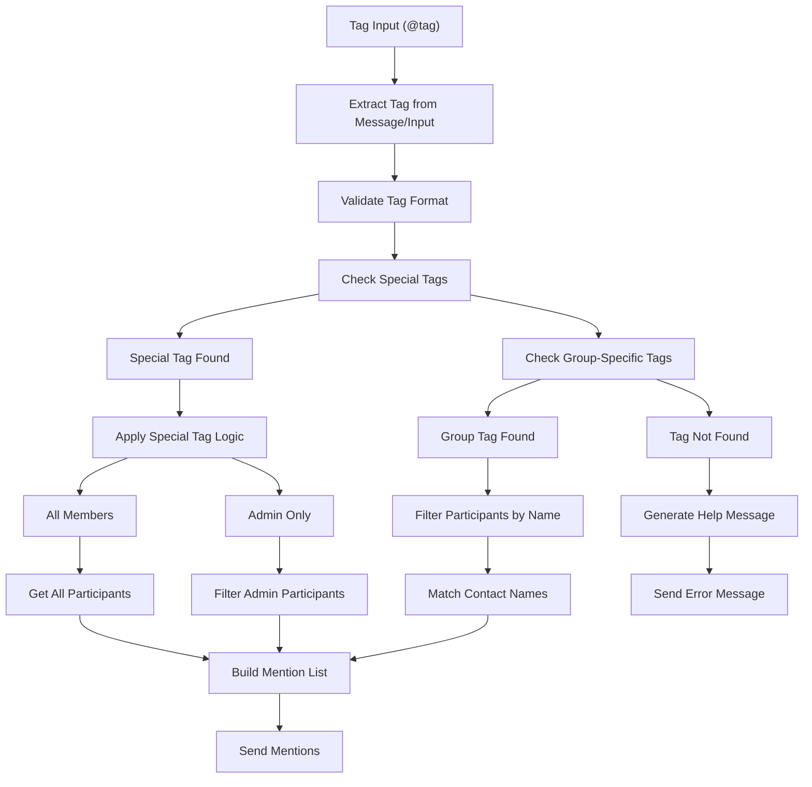
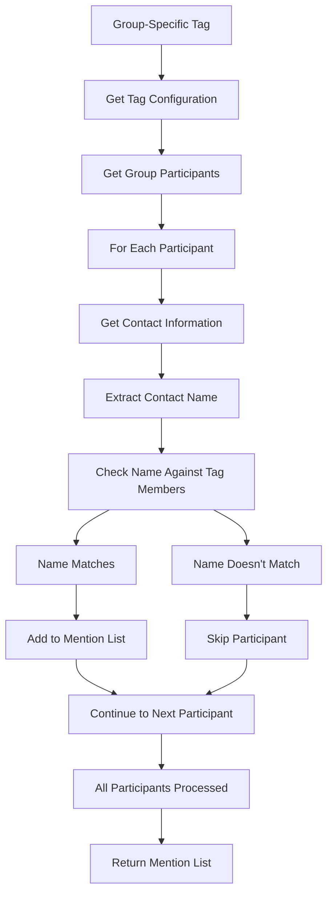
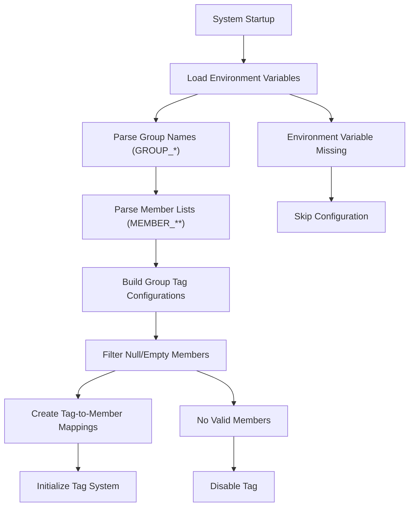

# Tags Module Documentation

## Overview

Group member tagging system for WhatsApp that enables targeted mentions of specific user groups through customizable tags. Features environment variable-based member management, group-specific tag configurations, special universal tags, case-insensitive matching, and intelligent participant filtering. Supports both predefined role-based tags and dynamic all-member/admin-only mentions.

## Core Features

- **Group-Specific Tags**: Customizable tags for different member groups within each WhatsApp group
- **Universal Special Tags**: Cross-group tags like @all, @everyone, @todos, @admin, @admins
- **Environment Variable Integration**: Dynamic member management through .env configuration
- **Case-Insensitive Matching**: Flexible tag recognition regardless of capitalization
- **Role-Based Filtering**: Automatic admin detection and role-based mentions
- **Contact Name Matching**: Intelligent participant identification through name comparison
- **Error Handling**: Comprehensive tag validation with helpful error messages
- **Auto-Deletion Management**: Configurable cleanup of error messages

## Usage Examples

### Group-Specific Tags
```javascript
// Example for GROUP_LF
@medicos           // Mentions doctors in the group
@engenheiros       // Mentions engineers in the group
@cartola           // Mentions Cartola FC players

// Example for GROUP_AG
@team1             // Mentions Team 1 members
@team2             // Mentions Team 2 members
@managers          // Mentions management team
```

### Universal Special Tags
```javascript
@all               // Mentions all group members
@everyone          // Mentions all group members
@todos             // Mentions all group members (Portuguese)
@admin             // Mentions only group administrators
@admins            // Mentions only group administrators
```

### Tags with Additional Text
```javascript
@medicos Reunião amanhã às 14h    // Tag with message
@all Importante: nova política     // Universal tag with announcement
```

## Architecture Overview

The tags module implements a **Hierarchical Tag Resolution Pattern**:

1. **Tag Extraction**: Parses tag from message or NLP input
2. **Tag Classification**: Determines if tag is special (universal) or group-specific
3. **Member Resolution**: Maps tags to actual WhatsApp participants
4. **Contact Matching**: Filters participants based on name matching criteria
5. **Mention Generation**: Creates WhatsApp mentions with participant IDs

**Processing Flow**:
```
Tag Input → Tag Validation → Classification (Special/Group) → Member Resolution → Contact Matching → Mention Creation → Response
```

**Design Patterns**:
- **Strategy Pattern**: Different resolution strategies for special vs. group-specific tags
- **Template Method Pattern**: Standardized tag processing with specialized member resolution
- **Configuration-Driven**: Environment variable-based member management
- **Hierarchical Lookup**: Special tags override group-specific tags

## File Structure & Roles

```
tags/
├── tags.js             # Main command handler and tag processing logic
├── tags.config.js      # Configuration management and tag definitions
└── tagUtils.js         # Utility functions for tag operations
```

### File Responsibilities

- **`tags.js`**: Primary command handler, tag extraction, participant filtering, mention generation
- **`tags.config.js`**: Tag configuration management, environment variable integration, member definitions
- **`tagUtils.js`**: Utility functions for tag discovery and group operations

## Core Components

### Main Tag Handler (`tags.js`)
```javascript
async function handleTags(message, command, input) {
    const chat = await message.getChat();
    if (!chat.isGroup) return;
    
    // Extract tag from input or message
    let tag = input && input.trim().startsWith('@') 
        ? input.trim().split(/\s+/)[0]
        : message.body.trim().split(/\s+/)[0];
    
    if (!tag.startsWith('@')) return;
    
    const participants = await chat.participants;
    let mentions = [];
    let tagFound = false;
    
    // Handle special tags (case insensitive)
    const lowerTag = tag.toLowerCase();
    const specialTagMatch = Object.keys(command.specialTags)
        .find(t => t.toLowerCase() === lowerTag);
    
    if (specialTagMatch) {
        const tagConfig = command.specialTags[specialTagMatch];
        tagFound = true;
        
        if (tagConfig.type === 'all_members') {
            mentions = participants.map(p => p.id._serialized);
        } else if (tagConfig.type === 'admin_only') {
            mentions = participants.filter(p => p.isAdmin).map(p => p.id._serialized);
        }
    }
    // Handle group-specific tags
    else if (command.groupTags[chat.name]) {
        const groupTagMatch = Object.keys(command.groupTags[chat.name])
            .find(t => t.toLowerCase() === lowerTag);
        
        if (groupTagMatch) {
            const tagConfig = command.groupTags[chat.name][groupTagMatch];
            tagFound = true;
            
            // Filter participants by name matching
            for (const participant of participants) {
                const contact = await global.client.getContactById(participant.id._serialized);
                const contactName = contact.name || contact.pushname || '';
                if (tagConfig.members.some(filter => 
                    contactName.toLowerCase().includes(filter.toLowerCase())
                )) {
                    mentions.push(participant.id._serialized);
                }
            }
        }
    }
    
    // Send mentions or error message
    if (tagFound && mentions.length > 0) {
        const text = mentions.map(id => `@${id.split('@')[0]}`).join(' ');
        await chat.sendMessage(text, {
            mentions,
            quotedMessageId: message.id._serialized
        });
    }
}
```

### Configuration Management (`tags.config.js`)
```javascript
// Environment variable integration
function getMembersByPrefix(prefix) {
    const members = {};
    Object.keys(process.env).forEach(key => {
        if (key.startsWith(`MEMBER_${prefix}`)) {
            members[key] = process.env[key];
        }
    });
    return members;
}

// Group-specific tag configuration
const TAGS_CONFIG = {
    groupTags: {
        [process.env.GROUP_LF]: {
            '@medicos': {
                members: [process.env.MEMBER_LF1, process.env.MEMBER_LF2].filter(Boolean),
                description: 'Médicos do grupo'
            },
            '@engenheiros': {
                members: [
                    process.env.MEMBER_LF3,
                    process.env.MEMBER_LF4,
                    process.env.MEMBER_LF5,
                    process.env.MEMBER_LF6,
                    process.env.MEMBER_LF7
                ].filter(Boolean),
                description: 'Engenheiros do grupo'
            }
        }
    },
    
    // Universal special tags
    specialTags: {
        '@all': { type: 'all_members', description: 'Todos os membros do grupo' },
        '@admin': { type: 'admin_only', description: 'Apenas administradores do grupo' }
    }
};
```

### Tag Utility Functions (`tagUtils.js`)
```javascript
function getAvailableTagsForGroup(config, groupName) {
    const tagCommand = config.COMMANDS.TAGS;
    const tags = [...Object.keys(tagCommand.specialTags)];
    
    if (tagCommand.groupTags[groupName]) {
        tags.push(...Object.keys(tagCommand.groupTags[groupName]));
    }
    
    return tags;
}
```

## Data Flows

### Tag Processing Flow


### Member Resolution Flow


### Environment Variable Integration Flow


## Configuration Schema

### Main Configuration (`tag.config.js`)
```javascript
{
    description: "string",                    // Command description
    autoDelete: {
        errorMessages: boolean,               // Auto-delete error messages
        commandMessages: boolean,             // Auto-delete command responses
        deleteTimeout: number                 // Deletion delay in milliseconds
    },
    errorMessages: {
        notAllowed: "string",                 // Permission denied message
        noMatches: "string"                   // No members found message
    },
    useGroupPersonality: boolean,             // Group context usage
    
    groupTags: {
        [groupName]: {
            "@tagName": {
                members: ["string"],          // Array of member name filters
                description: "string"         // Tag description
            }
        }
    },
    
    specialTags: {
        "@tagName": {
            type: "string",                   // Tag type (all_members, admin_only)
            description: "string"             // Tag description
        }
    }
}
```

### Environment Variable Schema
```javascript
// Group identification
GROUP_[ABBREVIATION] = "Group Name"           // WhatsApp group names

// Member identification
MEMBER_[ABBREVIATION]1 = "Member Name"        // Member name filters
MEMBER_[ABBREVIATION]2 = "Member Name"        // Additional members
MEMBER_[ABBREVIATION]N = "Member Name"        // Nth member

// Example configuration
GROUP_LF = "Lifelong Friends"
MEMBER_LF1 = "Dr. Silva"
MEMBER_LF2 = "Dr. Santos"
MEMBER_LF3 = "Eng. Costa"
```

### Tag Type Definitions
```javascript
// Special tag types
const tagTypes = {
    all_members: "Mentions all group participants",
    admin_only: "Mentions only group administrators"
};

// Group-specific tag structure
const groupTagStructure = {
    members: ["array of name filters"],       // Name matching criteria
    description: "human-readable description" // Tag purpose description
};
```

## External Dependencies

### WhatsApp Web.js Integration
- **Group Management**: Group participant access and admin role detection
- **Contact Resolution**: Contact information retrieval for name matching
- **Mention System**: Native WhatsApp mention functionality with participant IDs
- **Message Handling**: Quoted message support and message sending

### Environment Variable System
- **dotenv**: Environment variable loading from .env files
- **Dynamic Configuration**: Runtime configuration based on environment variables
- **Member Management**: Flexible member list management through environment variables

## Internal Dependencies

### Core System Dependencies
```javascript
// Logging system
const logger = require('../utils/logger');

// Message handling utilities
const { handleAutoDelete } = require('../utils/messageUtils');

// Environment variable access
require('dotenv').config({ path: './configs/.env' });
```

### Cross-Module Relationships
- **Logging System**: Comprehensive debug and error tracking for tag processing
- **Message Utilities**: Auto-deletion management for error messages
- **Configuration System**: Integration with centralized configuration management
- **Environment Management**: Dynamic configuration through environment variables

### Data Sharing Patterns
- **Environment Variable Integration**: Centralized member management through .env configuration
- **Configuration Distribution**: Hierarchical tag configuration with group-specific overrides
- **Error Handling**: Standardized error messages with auto-deletion patterns
- **Contact Resolution**: Shared contact name resolution and matching logic

### Processing Integration Points
- **Command System**: Integration with core command handler and NLP processor
- **Group Management**: Coordination with group-specific features and permissions
- **Member Management**: Dynamic member list updates through environment variable changes
- **Mention System**: Integration with WhatsApp's native mention functionality

### Tag Resolution Hierarchy
- **Special Tags**: Universal tags that work across all groups (highest priority)
- **Group-Specific Tags**: Custom tags defined per group (secondary priority)
- **Case Insensitive**: All tag matching is case-insensitive for user convenience
- **Name Matching**: Flexible name matching using substring comparison for member identification 